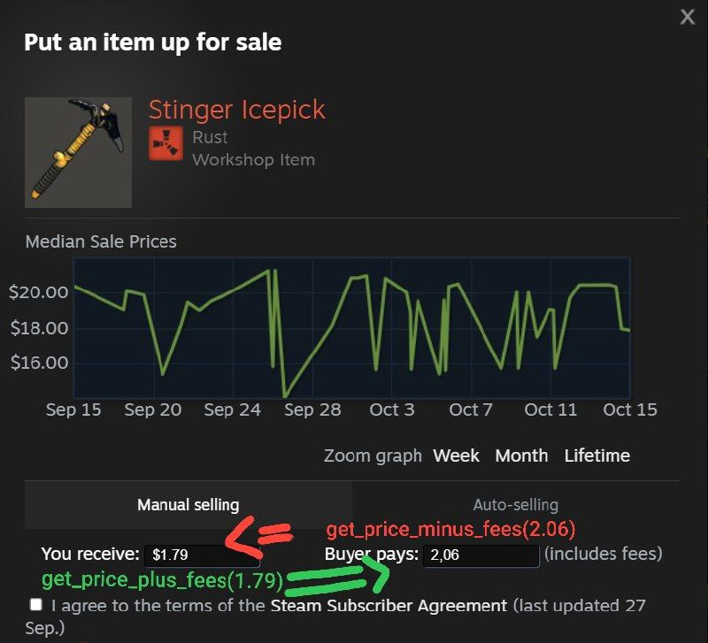

# steam_market_fees
- js reference (which I've modified and adapted to python): https://github.com/GiovanneBohms/SteamTaxesFeesMarketPlace
  
 calculating the price with and without commission on the steem marketplace

